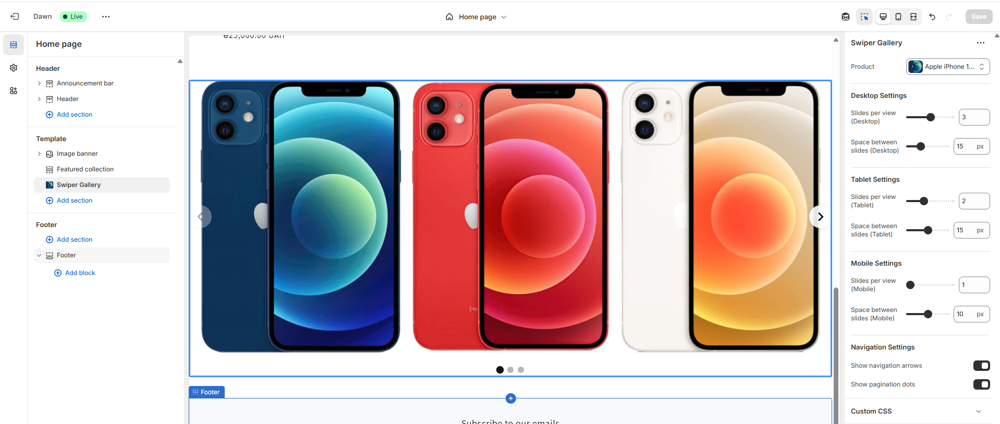

# Snippets for Swiper Gallery and Accordion using Shopify Metafields. 
Easily customizable and connected to product metafields for dynamic content

## swiper gallery
[View snippet swiper-gallery installation manuall](https://github.com/ovcharovcoder/test-ovcharov-store-2025/blob/main/Manual.pdf)

## accordion via metafields
[View snippet swiper-gallery installation manuall](https://github.com/ovcharovcoder/test-ovcharov-store-2025/blob/main/manual_accordion_metafields.pdf)

